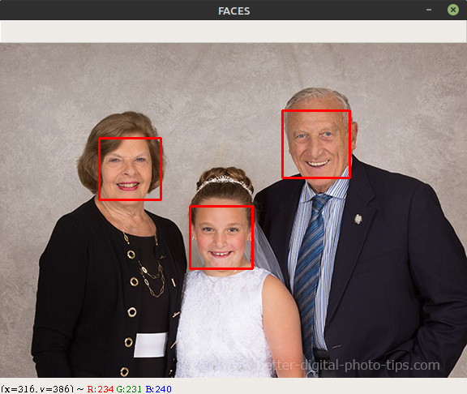
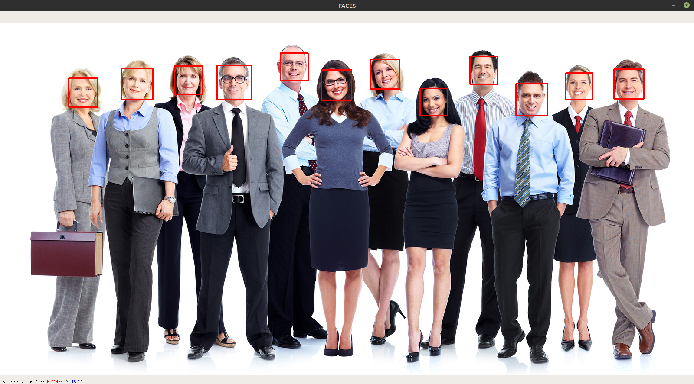

# Image Recognition Using Python and OpenCV
This is a simple program which draws a Red Box around faces in an image file/ Camera Stream using Python and OpenCV (using Haar Cascade Classifier).

## Installation of OpenCV
Use the package manager [pip](https://pip.pypa.io/en/stable/) to install OpenCV Library
```bash
$ pip install opencv-python
```

## Usage
In face_recognition.py 
Specify the Image Path on Line 5.
```python
# Loading Image Path
imagePath = "img/1.png"
```
\
In face_recognition_live.py, make sure that there is a functioning Webcam connected to the Computer.
\
To Exit from the Webcam Capture (Image display) press q.

## Examples
 


## Image Source
Google Images : https://www.google.co.in/imghp
